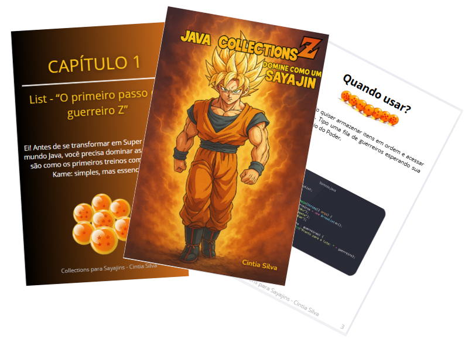

-------

# Projeto EBOOK Gerado por IA

 > ℹ️ **NOTA:** Este é o repositório desenvolvido como atividade do desafio de projeto **"Criando um Ebook com ChatGPT & MidJourney"** da plataforma [DIO](https://dio.me/) . O curso é ministrado por Felipe Aguiar.

Projeto com o objetivo de gerar um ebook digital com as facilidades das ferramentas de IA. todos os prompts
seguem abaixo.

<a href="https://github.com/cintiaasilva/prompts-recipe-to-create-a-ebook/blob/main/output/E-Book.pdf" title="View PDF now"> 📕Clique aqui para ler</a>

## 💻 Tecnologias utilizadas no projeto

- [ChatGPT](https://chat.openai.com/) 
- [Canva](https://www.canva.com/)

## 🧠 Prompts

ChatGPT：

|     Ação      | prompt                                                       |
| :-----------: | ------------------------------------------------------------ |
|    título     | Crie um título de ebook sobre o tema Java da matéria de Collections, o ebook é do nicho de programação e o subnicho é de Java, o título deve ser épico e curto, e tenha uma temática de dragon ball, me liste 5 variações de títulos |
|   conteúdo    | Faça um texto para ebook, com foco em Collections, listando as principais coleções do Java com exemplos em código {REGRAS} Explique sempre de uma maneira simples Deixe o texto enxuto, sempre traga exemplos de código em contextos reais , sempre deixe um título sugestivo por tópico, e no tom do personagem Goku de dragon ball Z |
|  imagem-capa  | Gere uma imagem de capa de livro em estilo anime inspirada em Dragon Ball Z. Um poderoso guerreiro Saiyajin com cabelos dourados espetados, usando um quimono laranja de artes marciais e pulseiras azuis, em pé, confiante, com os punhos cerrados. O fundo é um céu dramático com ondas de energia brilhantes, relâmpagos e nuvens laranja/amarelas. Iluminação dinâmica, forte contraste, pose heroica, sombreamento vívido de anime. |
| imagem-titulo | Gere uma imagem com o fundo transparente, com a frase Java Collections Z: Domine como um Sayajin no tema do anime dragon ball Z |

## ✨ Features

- Conteúdo, título e imagens gerados via ChatGPT

## 📚 Materiais

- Imagens utilizadas em `assets`
- ebook gerado durante as aulas em `output`

## 🛠️ Instruções de execução

Utilize os prompts acima nas ferramentas sugeridas para gerar o material base e utilize uma ferramenta de edição de documentos como power point, libreoffice , indesign para diagramação ou Canva.

## 👨‍💻 Developer

    <a href="https://github.com/cintiaasilva">
    GitHub</a>&nbsp;|&nbsp;
    <a href="https://www.linkedin.com/in/cintia-silva26/">LinkedIn</a>

